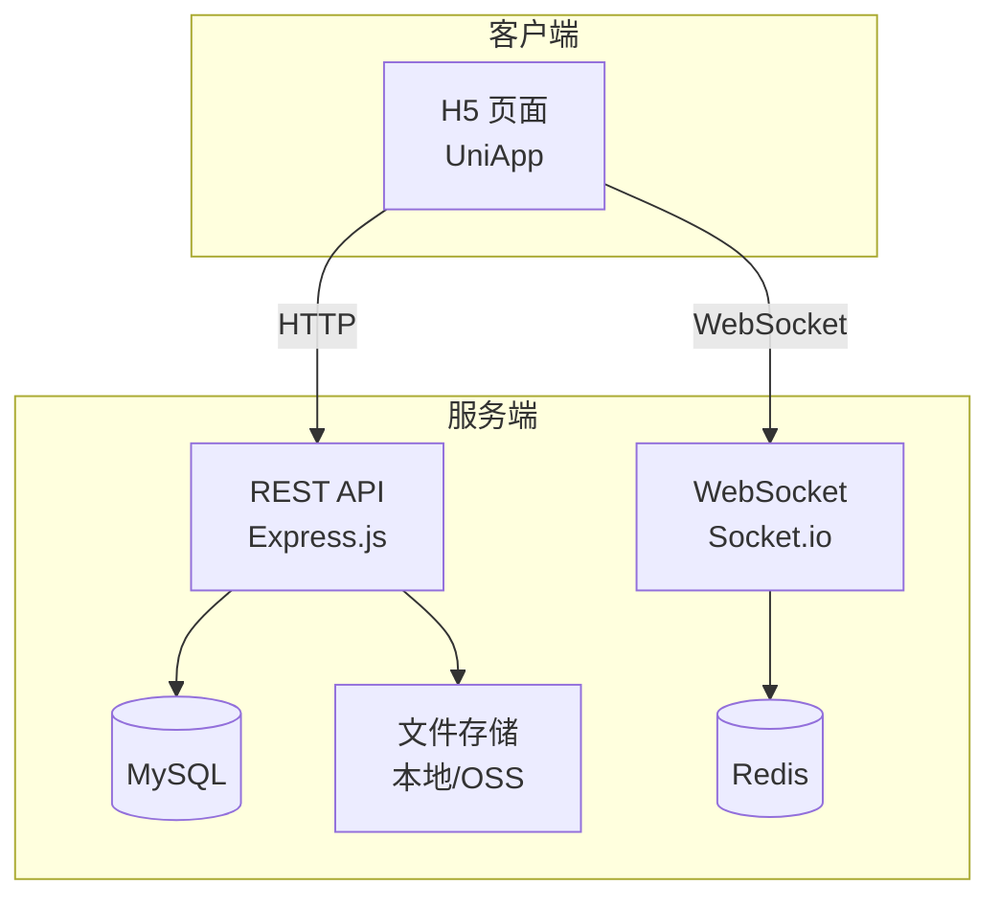
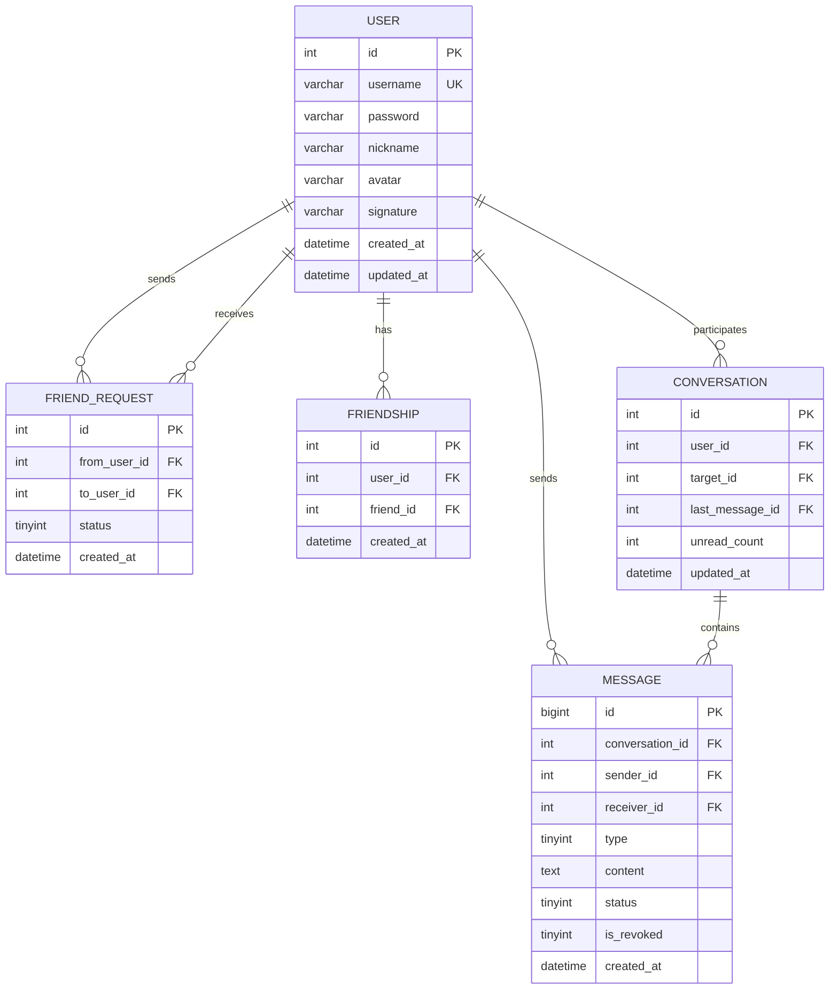
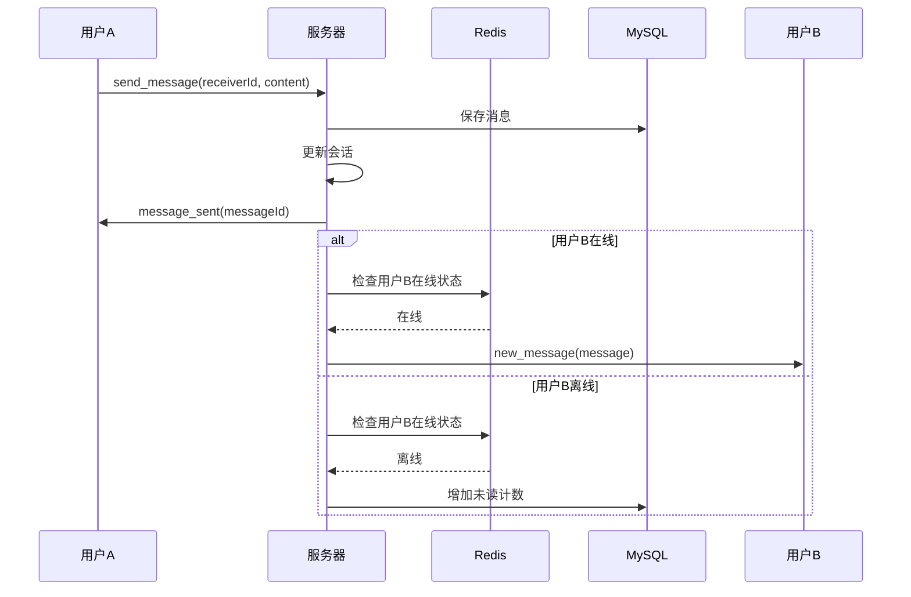
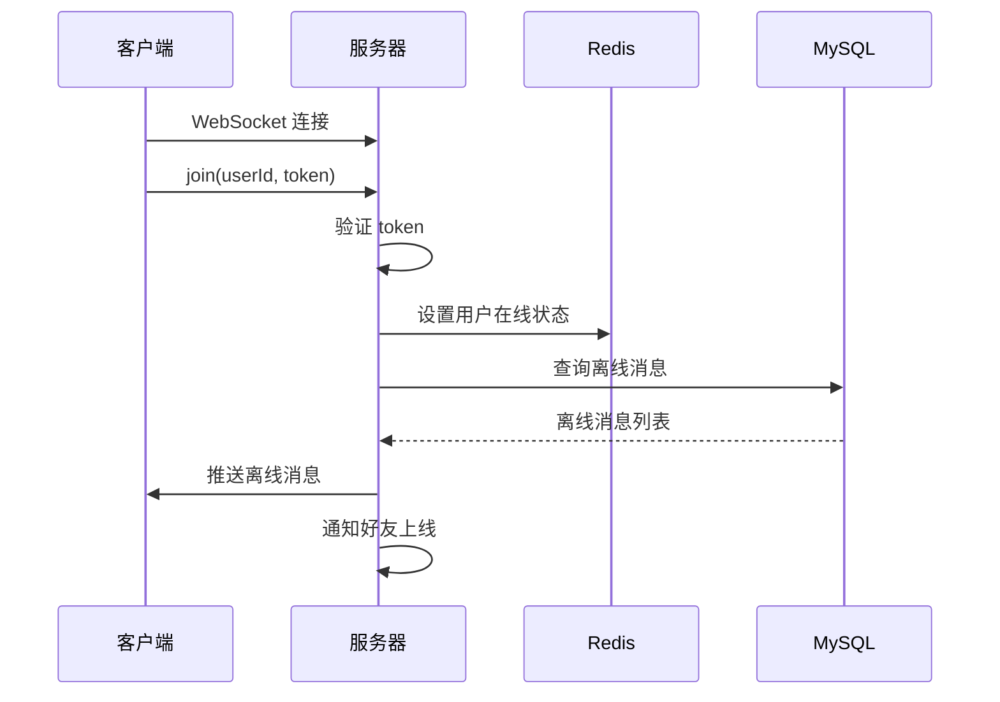
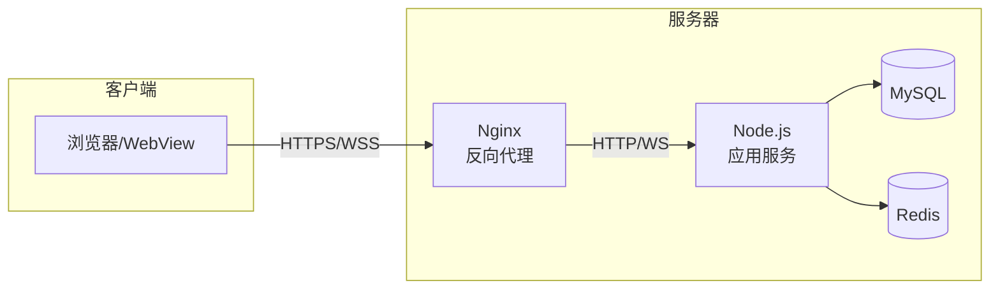
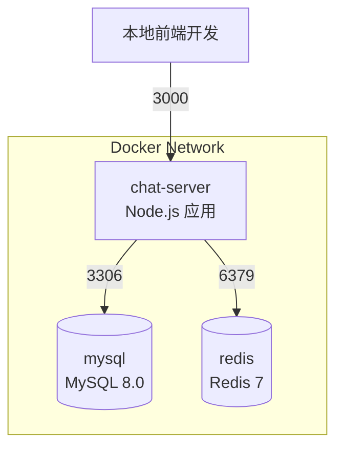

# 聊天室应用技术方案设计

## 1. 系统架构

### 1.1 整体架构图



### 1.2 技术架构说明

| 层级 | 技术选型 | 说明 |
|------|----------|------|
| 前端框架 | UniApp (Vue3 + TS) | 跨平台，H5 优先 |
| UI 组件 | uni-ui | 官方组件库，兼容性好 |
| 状态管理 | Pinia | Vue3 官方推荐 |
| WebSocket | @hyoga/uni-socket.io | UniApp 适配的 Socket.io 客户端 |
| 后端框架 | Express.js | 轻量、成熟 |
| 实时通信 | Socket.io 4.x | 事件驱动，自动重连 |
| 数据库 | MySQL 8.0 | 关系型数据，数据一致性 |
| 缓存 | Redis | 在线状态、消息队列 |
| 文件存储 | 本地存储 | 初期使用，后续可迁移 OSS |

---

## 2. 目录结构

### 2.1 前端目录结构

```
chat-app-client/
├── src/
│   ├── api/                    # API 接口
│   │   ├── user.ts             # 用户相关接口
│   │   ├── friend.ts           # 好友相关接口
│   │   ├── message.ts          # 消息相关接口
│   │   └── upload.ts           # 文件上传接口
│   ├── components/             # 公共组件
│   │   ├── ChatBubble.vue      # 消息气泡
│   │   ├── VoiceRecorder.vue   # 语音录制
│   │   ├── ImagePicker.vue     # 图片选择
│   │   └── AvatarUpload.vue    # 头像上传
│   ├── pages/                  # 页面
│   │   ├── login/              # 登录
│   │   ├── register/           # 注册
│   │   ├── message/            # 消息列表
│   │   ├── contacts/           # 通讯录
│   │   ├── profile/            # 我的
│   │   ├── chat/               # 聊天详情
│   │   ├── add-friend/         # 添加好友
│   │   ├── new-friends/        # 新的朋友
│   │   ├── user-profile/       # 用户资料
│   │   └── edit-profile/       # 编辑资料
│   ├── stores/                 # Pinia 状态管理
│   │   ├── user.ts             # 用户状态
│   │   ├── conversation.ts     # 会话状态
│   │   └── socket.ts           # Socket 连接状态
│   ├── utils/                  # 工具函数
│   │   ├── request.ts          # HTTP 请求封装
│   │   ├── socket.ts           # Socket.io 封装
│   │   ├── storage.ts          # 本地存储
│   │   └── audio.ts            # 音频处理
│   ├── static/                 # 静态资源
│   ├── App.vue
│   ├── main.ts
│   ├── pages.json              # 页面配置
│   ├── manifest.json           # 应用配置
│   └── uni.scss                # 全局样式变量
├── package.json
└── tsconfig.json
```

### 2.2 后端目录结构

```
chat-app-server/
├── src/
│   ├── config/                 # 配置文件
│   │   ├── database.js         # 数据库配置
│   │   ├── redis.js            # Redis 配置
│   │   └── socket.js           # Socket.io 配置
│   ├── controllers/            # 控制器
│   │   ├── authController.js   # 认证控制器
│   │   ├── userController.js   # 用户控制器
│   │   ├── friendController.js # 好友控制器
│   │   ├── messageController.js# 消息控制器
│   │   └── uploadController.js # 上传控制器
│   ├── middlewares/            # 中间件
│   │   ├── auth.js             # JWT 认证
│   │   ├── validator.js        # 参数校验
│   │   └── errorHandler.js     # 错误处理
│   ├── models/                 # 数据模型
│   │   ├── User.js
│   │   ├── Friend.js
│   │   ├── Message.js
│   │   └── Conversation.js
│   ├── routes/                 # 路由
│   │   ├── auth.js
│   │   ├── user.js
│   │   ├── friend.js
│   │   ├── message.js
│   │   └── upload.js
│   ├── services/               # 业务逻辑
│   │   ├── authService.js
│   │   ├── userService.js
│   │   ├── friendService.js
│   │   └── messageService.js
│   ├── socket/                 # Socket.io 处理
│   │   ├── index.js            # Socket 入口
│   │   ├── handlers/           # 事件处理器
│   │   │   ├── messageHandler.js
│   │   │   ├── friendHandler.js
│   │   │   └── statusHandler.js
│   │   └── middleware.js       # Socket 中间件
│   ├── utils/                  # 工具函数
│   │   ├── jwt.js
│   │   ├── bcrypt.js
│   │   └── pinyin.js           # 拼音处理（通讯录排序）
│   ├── uploads/                # 上传文件存储
│   └── app.js                  # 应用入口
├── package.json
└── .env                        # 环境变量
```

---

## 3. 数据库设计

### 3.1 ER 图



### 3.2 表结构详细设计

#### users 表（用户表）

| 字段 | 类型 | 说明 |
|------|------|------|
| id | INT AUTO_INCREMENT | 主键 |
| username | VARCHAR(20) | 账号，唯一 |
| password | VARCHAR(100) | 密码（bcrypt 加密） |
| nickname | VARCHAR(20) | 昵称 |
| avatar | VARCHAR(255) | 头像 URL |
| signature | VARCHAR(50) | 个性签名 |
| created_at | DATETIME | 创建时间 |
| updated_at | DATETIME | 更新时间 |

#### friendships 表（好友关系表）

| 字段 | 类型 | 说明 |
|------|------|------|
| id | INT AUTO_INCREMENT | 主键 |
| user_id | INT | 用户 ID |
| friend_id | INT | 好友 ID |
| created_at | DATETIME | 成为好友时间 |

> 说明：双向存储，A 和 B 成为好友时插入两条记录

#### friend_requests 表（好友申请表）

| 字段 | 类型 | 说明 |
|------|------|------|
| id | INT AUTO_INCREMENT | 主键 |
| from_user_id | INT | 申请人 ID |
| to_user_id | INT | 被申请人 ID |
| status | TINYINT | 状态：0-待处理，1-已同意，2-已拒绝 |
| created_at | DATETIME | 申请时间 |

#### conversations 表（会话表）

| 字段 | 类型 | 说明 |
|------|------|------|
| id | INT AUTO_INCREMENT | 主键 |
| user_id | INT | 会话所属用户 |
| target_id | INT | 对方用户 ID |
| last_message_id | BIGINT | 最后一条消息 ID |
| unread_count | INT | 未读消息数 |
| updated_at | DATETIME | 最后更新时间 |

#### messages 表（消息表）

| 字段 | 类型 | 说明 |
|------|------|------|
| id | BIGINT AUTO_INCREMENT | 主键 |
| conversation_id | INT | 会话 ID |
| sender_id | INT | 发送者 ID |
| receiver_id | INT | 接收者 ID |
| type | TINYINT | 类型：1-文本，2-图片，3-语音 |
| content | TEXT | 内容（文本或文件URL） |
| duration | INT | 语音时长（秒），仅语音消息 |
| status | TINYINT | 状态：0-发送中，1-已发送，2-已读 |
| is_revoked | TINYINT | 是否撤回：0-否，1-是 |
| created_at | DATETIME | 发送时间 |

---

## 4. 接口设计

### 4.1 REST API 接口

#### 认证模块

| 方法 | 路径 | 说明 |
|------|------|------|
| POST | /api/auth/register | 用户注册 |
| POST | /api/auth/login | 用户登录 |
| POST | /api/auth/logout | 退出登录 |

#### 用户模块

| 方法 | 路径 | 说明 |
|------|------|------|
| GET | /api/user/profile | 获取当前用户信息 |
| PUT | /api/user/profile | 更新用户信息 |
| POST | /api/user/avatar | 上传头像 |
| GET | /api/user/search | 搜索用户 |

#### 好友模块

| 方法 | 路径 | 说明 |
|------|------|------|
| GET | /api/friends | 获取好友列表 |
| POST | /api/friends/request | 发送好友申请 |
| GET | /api/friends/requests | 获取好友申请列表 |
| POST | /api/friends/accept/:id | 同意好友申请 |
| POST | /api/friends/reject/:id | 拒绝好友申请 |
| DELETE | /api/friends/:id | 删除好友 |

#### 消息模块

| 方法 | 路径 | 说明 |
|------|------|------|
| GET | /api/conversations | 获取会话列表 |
| DELETE | /api/conversations/:id | 删除会话 |
| GET | /api/messages/:conversationId | 获取历史消息（分页） |

#### 上传模块

| 方法 | 路径 | 说明 |
|------|------|------|
| POST | /api/upload/image | 上传图片 |
| POST | /api/upload/voice | 上传语音 |

### 4.2 Socket.io 事件

#### 客户端 → 服务端

| 事件名 | 数据 | 说明 |
|--------|------|------|
| join | { userId } | 用户上线，加入房间 |
| send_message | { receiverId, type, content, duration? } | 发送消息 |
| message_read | { conversationId, messageIds } | 标记消息已读 |
| revoke_message | { messageId } | 撤回消息 |
| typing | { receiverId } | 正在输入 |

#### 服务端 → 客户端

| 事件名 | 数据 | 说明 |
|--------|------|------|
| new_message | { message } | 收到新消息 |
| message_sent | { messageId, status } | 消息发送成功 |
| message_read | { messageIds } | 消息被对方已读 |
| message_revoked | { messageId } | 消息被撤回 |
| friend_request | { request } | 收到好友申请 |
| friend_accepted | { friend } | 好友申请被同意 |
| user_online | { userId } | 好友上线 |
| user_offline | { userId } | 好友下线 |
| typing | { userId } | 对方正在输入 |

---

## 5. 核心流程

### 5.1 消息发送流程



### 5.2 用户上线流程



---

## 6. 安全性设计

### 6.1 认证与授权

| 安全措施 | 实现方式 |
|----------|----------|
| 密码加密 | bcrypt 加密存储，cost factor = 10 |
| 身份认证 | JWT Token，有效期 7 天 |
| Socket 认证 | 连接时携带 Token，中间件验证 |
| 接口鉴权 | Express 中间件统一校验 |

### 6.2 数据安全

| 安全措施 | 实现方式 |
|----------|----------|
| SQL 注入 | 使用参数化查询 |
| XSS 防护 | 消息内容转义处理 |
| 文件上传 | 限制类型、大小，重命名存储 |
| 敏感数据 | 接口返回时过滤密码等敏感字段 |

### 6.3 传输安全

- 生产环境使用 HTTPS
- WebSocket 使用 WSS 协议

---

## 7. 性能优化

### 7.1 前端优化

| 优化项 | 方案 |
|--------|------|
| 图片压缩 | 上传前压缩至 500KB 以内 |
| 消息分页 | 首次加载 20 条，滚动加载更多 |
| 虚拟列表 | 消息列表使用虚拟滚动 |
| 本地缓存 | 会话列表、消息使用本地存储缓存 |

### 7.2 后端优化

| 优化项 | 方案 |
|--------|------|
| 在线状态 | Redis 存储，快速读写 |
| 消息表索引 | conversation_id + created_at 联合索引 |
| 连接池 | MySQL 连接池，最大连接数 10 |
| 文件存储 | 按日期分目录存储 |

---

## 8. 部署架构



### 8.1 环境配置

| 环境 | 配置 |
|------|------|
| Node.js | 18.x LTS |
| MySQL | 8.0 |
| Redis | 7.x |
| Nginx | 最新稳定版 |

---

## 9. 测试策略

| 测试类型 | 工具 | 覆盖范围 |
|----------|------|----------|
| 单元测试 | Jest | 工具函数、业务逻辑 |
| 接口测试 | Postman | REST API |
| Socket 测试 | socket.io-client | 实时通信事件 |
| 手工测试 | - | 完整业务流程 |

---

## 10. Docker 开发环境

### 10.1 容器架构



### 10.2 服务配置

| 服务 | 镜像 | 端口映射 | 说明 |
|------|------|----------|------|
| chat-server | node:18-alpine | 3000:3000 | 后端应用（热重载） |
| mysql | mysql:8.0 | 3306:3306 | 数据库 |
| redis | redis:7-alpine | 6379:6379 | 缓存 |

### 10.3 docker-compose.yml

```yaml
version: '3.8'

services:
  # Node.js 后端服务
  chat-server:
    build:
      context: ./server
      dockerfile: Dockerfile
    container_name: chat-server
    ports:
      - "3000:3000"
    volumes:
      - ./server:/app
      - /app/node_modules
      - ./server/uploads:/app/uploads
    environment:
      - NODE_ENV=development
      - DB_HOST=mysql
      - DB_PORT=3306
      - DB_USER=root
      - DB_PASSWORD=chat123456
      - DB_NAME=chat_app
      - REDIS_HOST=redis
      - REDIS_PORT=6379
      - JWT_SECRET=your-jwt-secret-key
    depends_on:
      mysql:
        condition: service_healthy
      redis:
        condition: service_started
    command: npm run dev
    networks:
      - chat-network

  # MySQL 数据库
  mysql:
    image: mysql:8.0
    container_name: chat-mysql
    ports:
      - "3306:3306"
    environment:
      - MYSQL_ROOT_PASSWORD=chat123456
      - MYSQL_DATABASE=chat_app
      - TZ=Asia/Shanghai
    volumes:
      - mysql_data:/var/lib/mysql
      - ./server/sql/init.sql:/docker-entrypoint-initdb.d/init.sql
    command: --default-authentication-plugin=mysql_native_password --character-set-server=utf8mb4 --collation-server=utf8mb4_unicode_ci
    healthcheck:
      test: ["CMD", "mysqladmin", "ping", "-h", "localhost"]
      interval: 10s
      timeout: 5s
      retries: 5
    networks:
      - chat-network

  # Redis 缓存
  redis:
    image: redis:7-alpine
    container_name: chat-redis
    ports:
      - "6379:6379"
    volumes:
      - redis_data:/data
    command: redis-server --appendonly yes
    networks:
      - chat-network

networks:
  chat-network:
    driver: bridge

volumes:
  mysql_data:
  redis_data:
```

### 10.4 后端 Dockerfile

```dockerfile
FROM node:18-alpine

WORKDIR /app

# 安装 nodemon 用于热重载
RUN npm install -g nodemon

# 复制 package.json
COPY package*.json ./

# 安装依赖
RUN npm install

# 复制源代码
COPY . .

EXPOSE 3000

CMD ["npm", "run", "dev"]
```

### 10.5 开发命令

```bash
# 启动所有服务
docker-compose up -d

# 查看日志
docker-compose logs -f chat-server

# 停止所有服务
docker-compose down

# 重建服务（依赖变更后）
docker-compose up -d --build chat-server

# 进入 MySQL 容器
docker exec -it chat-mysql mysql -uroot -pchat123456 chat_app

# 进入 Redis 容器
docker exec -it chat-redis redis-cli
```

### 10.6 项目根目录结构

```
LT/
├── docker-compose.yml          # Docker 编排配置
├── client/                     # 前端项目（本地运行）
│   └── ...
├── server/                     # 后端项目（Docker 运行）
│   ├── Dockerfile
│   ├── src/
│   ├── sql/
│   │   └── init.sql           # 数据库初始化脚本
│   └── ...
└── specs/                      # 规格文档
    └── chat-app/
```

### 10.7 本地开发流程

1. **启动后端服务**：`docker-compose up -d`
2. **启动前端开发**：`cd client && npm run dev:h5`
3. **前端访问**：http://localhost:5173（Vite 默认端口）
4. **后端 API**：http://localhost:3000
5. **WebSocket**：ws://localhost:3000
