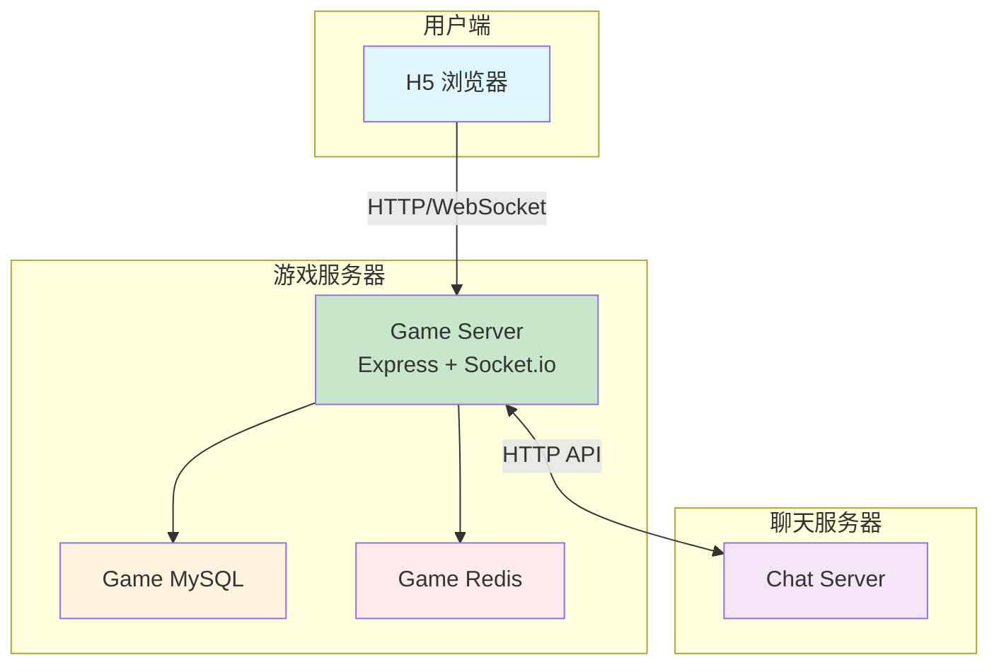
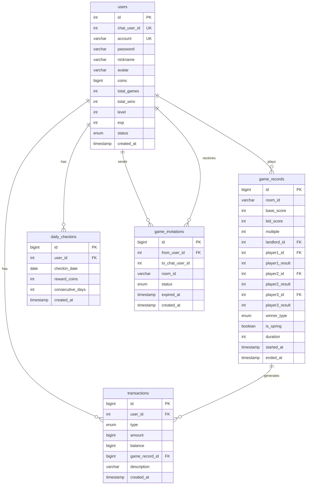

# 斗地主游戏技术方案设计

## 1. 整体架构

### 1.1 系统架构图



### 1.2 部署架构

```
┌─────────────────────────────────────┐
│         游戏服务器 (独立部署)         │
│                                     │
│  ┌─────────┐  ┌─────────┐  ┌─────┐ │
│  │ Nginx   │──│ Node.js │──│MySQL│ │
│  │ :80/443 │  │ :4000   │  │:3307│ │
│  └─────────┘  └─────────┘  └─────┘ │
│                    │               │
│              ┌─────────┐           │
│              │  Redis  │           │
│              │  :6380  │           │
│              └─────────┘           │
└─────────────────────────────────────┘
          │
          │ HTTP API (公网)
          ▼
┌─────────────────────────────────────┐
│         聊天服务器 (独立部署)         │
└─────────────────────────────────────┘
```

### 1.3 开发环境端口分配

| 服务 | 聊天应用 (chat-app) | 游戏应用 (doudizhu-game) |
|------|---------------------|--------------------------|
| MySQL | 3306 | **3307** |
| Redis | 6379 | **6380** |
| HTTP Server | 3000 | **4000** |
| 前端 Dev Server | 8080 | **8081** |

> **注意**：开发阶段两个项目可以同时运行，端口不会冲突。

---

## 2. 技术栈

### 2.1 前端技术栈

| 技术 | 版本 | 用途 |
|------|------|------|
| Vue 3 | 3.4+ | 前端框架（大厅、房间等页面） |
| **Phaser 3** | 3.80+ | **游戏引擎（游戏界面渲染）** |
| TypeScript | 5.0+ | 类型安全 |
| Vite | 5.0+ | 构建工具 |
| Pinia | 2.1+ | 状态管理 |
| Socket.io Client | 4.7+ | 实时通信 |
| Axios | 1.6+ | HTTP 请求 |
| SCSS | - | 样式预处理 |

#### Phaser 3 使用说明

**为什么选择 Phaser 3：**
- 专业的 2D 游戏引擎，性能优秀
- 丰富的动画系统（Tween、Sprite 动画）
- 完善的输入处理（点击、拖拽）
- 场景管理（Scene）便于组织游戏逻辑
- 大量现成的插件和社区支持

**Vue + Phaser 集成方案：**
- Vue 负责：登录、大厅、房间等 UI 页面
- Phaser 负责：游戏界面（牌桌、扑克牌、动画效果）
- 通过 Pinia Store 共享状态，Socket 事件驱动游戏更新

### 2.2 后端技术栈

| 技术 | 版本 | 用途 |
|------|------|------|
| Node.js | 18+ | 运行环境 |
| Express | 4.18+ | HTTP 服务 |
| Socket.io | 4.7+ | WebSocket |
| MySQL | 8.0 | 持久化存储 |
| Redis | 7.0 | 缓存/游戏状态 |
| JWT | - | 身份认证 |
| bcryptjs | - | 密码加密 |

### 2.3 部署技术

| 技术 | 用途 |
|------|------|
| Docker | 容器化 |
| Docker Compose | 服务编排 |
| Nginx | 反向代理/静态文件 |

---

## 3. 数据库设计

### 3.1 ER 图



### 3.2 表结构详细设计

```sql
-- 用户表
CREATE TABLE users (
    id INT PRIMARY KEY AUTO_INCREMENT,
    chat_user_id INT UNIQUE DEFAULT NULL COMMENT '关联聊天应用用户ID',
    account VARCHAR(50) NOT NULL UNIQUE,
    password VARCHAR(255) DEFAULT NULL,
    nickname VARCHAR(50) NOT NULL,
    avatar VARCHAR(255) DEFAULT NULL,
    coins BIGINT DEFAULT 10000 COMMENT '金币余额',
    total_games INT DEFAULT 0 COMMENT '总场次',
    total_wins INT DEFAULT 0 COMMENT '胜场',
    max_win_streak INT DEFAULT 0 COMMENT '最高连胜',
    current_win_streak INT DEFAULT 0 COMMENT '当前连胜',
    level INT DEFAULT 1 COMMENT '等级',
    exp INT DEFAULT 0 COMMENT '经验值',
    status ENUM('active', 'banned') DEFAULT 'active',
    last_login_at TIMESTAMP DEFAULT NULL,
    created_at TIMESTAMP DEFAULT CURRENT_TIMESTAMP,
    updated_at TIMESTAMP DEFAULT CURRENT_TIMESTAMP ON UPDATE CURRENT_TIMESTAMP,
    INDEX idx_chat_user (chat_user_id),
    INDEX idx_coins (coins)
) ENGINE=InnoDB DEFAULT CHARSET=utf8mb4;

-- 游戏记录表
CREATE TABLE game_records (
    id BIGINT PRIMARY KEY AUTO_INCREMENT,
    room_id VARCHAR(36) NOT NULL,
    base_score INT NOT NULL COMMENT '底分',
    bid_score INT NOT NULL COMMENT '叫分(1-3)',
    multiple INT DEFAULT 1 COMMENT '总倍数',
    landlord_id INT NOT NULL,
    landlord_cards JSON COMMENT '底牌',
    player1_id INT NOT NULL,
    player1_seat TINYINT NOT NULL,
    player1_is_landlord BOOLEAN,
    player1_result BIGINT COMMENT '积分变化',
    player2_id INT NOT NULL,
    player2_seat TINYINT NOT NULL,
    player2_is_landlord BOOLEAN,
    player2_result BIGINT,
    player3_id INT NOT NULL,
    player3_seat TINYINT NOT NULL,
    player3_is_landlord BOOLEAN,
    player3_result BIGINT,
    winner_type ENUM('landlord', 'farmer') COMMENT '获胜方',
    is_spring BOOLEAN DEFAULT FALSE COMMENT '春天',
    is_anti_spring BOOLEAN DEFAULT FALSE COMMENT '反春',
    bomb_count INT DEFAULT 0 COMMENT '炸弹数量',
    duration INT COMMENT '游戏时长(秒)',
    started_at TIMESTAMP DEFAULT CURRENT_TIMESTAMP,
    ended_at TIMESTAMP DEFAULT NULL,
    INDEX idx_landlord (landlord_id),
    INDEX idx_started (started_at)
) ENGINE=InnoDB DEFAULT CHARSET=utf8mb4;

-- 积分交易记录表
CREATE TABLE transactions (
    id BIGINT PRIMARY KEY AUTO_INCREMENT,
    user_id INT NOT NULL,
    type ENUM('game_win', 'game_lose', 'checkin', 'bankrupt_aid', 'initial', 'system') NOT NULL,
    amount BIGINT NOT NULL COMMENT '变化金额',
    balance BIGINT NOT NULL COMMENT '变化后余额',
    game_record_id BIGINT DEFAULT NULL,
    description VARCHAR(255) DEFAULT NULL,
    created_at TIMESTAMP DEFAULT CURRENT_TIMESTAMP,
    INDEX idx_user_time (user_id, created_at),
    FOREIGN KEY (user_id) REFERENCES users(id),
    FOREIGN KEY (game_record_id) REFERENCES game_records(id)
) ENGINE=InnoDB DEFAULT CHARSET=utf8mb4;

-- 每日签到表
CREATE TABLE daily_checkins (
    id BIGINT PRIMARY KEY AUTO_INCREMENT,
    user_id INT NOT NULL,
    checkin_date DATE NOT NULL,
    reward_coins INT NOT NULL,
    consecutive_days INT DEFAULT 1,
    created_at TIMESTAMP DEFAULT CURRENT_TIMESTAMP,
    UNIQUE KEY uk_user_date (user_id, checkin_date),
    FOREIGN KEY (user_id) REFERENCES users(id)
) ENGINE=InnoDB DEFAULT CHARSET=utf8mb4;

-- 游戏邀请表
CREATE TABLE game_invitations (
    id BIGINT PRIMARY KEY AUTO_INCREMENT,
    from_user_id INT NOT NULL,
    to_chat_user_id INT NOT NULL COMMENT '被邀请人的聊天应用用户ID',
    room_id VARCHAR(36) NOT NULL,
    invite_code VARCHAR(32) UNIQUE NOT NULL,
    status ENUM('pending', 'accepted', 'expired', 'invalid') DEFAULT 'pending',
    expired_at TIMESTAMP NOT NULL,
    created_at TIMESTAMP DEFAULT CURRENT_TIMESTAMP,
    INDEX idx_code (invite_code),
    INDEX idx_to_user (to_chat_user_id, status),
    FOREIGN KEY (from_user_id) REFERENCES users(id)
) ENGINE=InnoDB DEFAULT CHARSET=utf8mb4;

-- 破产补助记录表
CREATE TABLE bankrupt_aids (
    id BIGINT PRIMARY KEY AUTO_INCREMENT,
    user_id INT NOT NULL,
    aid_date DATE NOT NULL,
    aid_count INT DEFAULT 1 COMMENT '当日领取次数',
    created_at TIMESTAMP DEFAULT CURRENT_TIMESTAMP,
    UNIQUE KEY uk_user_date (user_id, aid_date),
    FOREIGN KEY (user_id) REFERENCES users(id)
) ENGINE=InnoDB DEFAULT CHARSET=utf8mb4;
```

### 3.3 Redis 数据结构

```
# 用户在线状态
online:{userId} = socketId (STRING, TTL: none)

# 用户当前房间
user:room:{userId} = roomId (STRING, TTL: none)

# 房间信息 (Hash)
room:{roomId} = {
    id: string,
    ownerId: number,
    baseScore: number,
    password: string | null,
    status: 'waiting' | 'playing',
    createdAt: timestamp
} (TTL: 24h)

# 房间玩家 (Hash)
room:players:{roomId} = {
    seat0: JSON { userId, nickname, avatar, ready, coins },
    seat1: JSON { ... },
    seat2: JSON { ... }
} (TTL: 24h)

# 游戏状态 (Hash) - 核心
game:{roomId} = {
    phase: 'bidding' | 'playing' | 'ended',
    dealerSeat: number,          // 发牌起始座位
    currentSeat: number,         // 当前操作座位
    landlordSeat: number,        // 地主座位 (-1 表示未确定)
    bidHistory: JSON [],         // 叫分历史 [{seat, bid}]
    currentBid: number,          // 当前最高叫分
    multiple: number,            // 当前倍数
    lastPlaySeat: number,        // 上一个出牌座位
    lastPlayCards: JSON [],      // 上一手牌
    lastPlayType: string,        // 上一手牌型
    turnStartTime: timestamp,    // 当前轮开始时间
    bombCount: number            // 炸弹计数
} (TTL: 2h)

# 玩家手牌 (List)
game:hand:{roomId}:{seat} = [cardId1, cardId2, ...] (TTL: 2h)

# 底牌 (List)
game:landlord:{roomId} = [cardId1, cardId2, cardId3] (TTL: 2h)

# 出牌历史 (List)
game:history:{roomId} = [
    JSON { seat, cards, type, time },
    ...
] (TTL: 2h)

# 公开房间列表 (Sorted Set, score = createdAt)
rooms:public = [roomId1, roomId2, ...]

# 快速匹配队列 (List)
match:queue:{baseScore} = [userId1, userId2, ...]

# 断线重连 Token
reconnect:{roomId}:{userId} = token (TTL: 60s)
```

---

## 4. API 接口设计

### 4.1 认证相关

| 方法 | 路径 | 说明 |
|------|------|------|
| POST | `/api/auth/register` | 注册 |
| POST | `/api/auth/login` | 登录 |
| POST | `/api/auth/login-from-chat` | 从聊天应用跳转登录 |
| GET | `/api/auth/profile` | 获取当前用户信息 |

#### 请求/响应示例

```typescript
// POST /api/auth/register
Request: { account: string, password: string, nickname: string }
Response: { code: 200, data: { token: string, user: User } }

// POST /api/auth/login-from-chat
Request: { chatToken: string }
Response: { code: 200, data: { token: string, user: User, isNewUser: boolean } }
```

### 4.2 用户相关

| 方法 | 路径 | 说明 |
|------|------|------|
| GET | `/api/user/profile` | 获取个人信息 |
| PUT | `/api/user/profile` | 更新昵称 |
| GET | `/api/user/stats` | 获取战绩统计 |

### 4.3 积分相关

| 方法 | 路径 | 说明 |
|------|------|------|
| POST | `/api/coins/checkin` | 每日签到 |
| GET | `/api/coins/checkin-status` | 签到状态 |
| POST | `/api/coins/bankrupt-aid` | 领取破产补助 |
| GET | `/api/coins/transactions` | 交易记录 |

### 4.4 房间相关

| 方法 | 路径 | 说明 |
|------|------|------|
| GET | `/api/rooms` | 房间列表 |
| POST | `/api/rooms` | 创建房间 |
| GET | `/api/rooms/:id` | 房间详情 |

### 4.5 集成 API（供聊天服务调用）

| 方法 | 路径 | 说明 |
|------|------|------|
| POST | `/api/integration/invite` | 创建游戏邀请 |
| GET | `/api/integration/join` | 通过邀请码加入 |
| POST | `/api/integration/verify-token` | 验证聊天 Token |

#### 集成 API 详细设计

```typescript
// POST /api/integration/invite
// Headers: X-API-Key: {apiKey}
Request: {
    chatToken: string,          // 邀请人的聊天 Token
    targetChatUserIds: number[], // 被邀请人的聊天用户 ID
    baseScore: number            // 底分
}
Response: {
    code: 200,
    data: {
        roomId: string,
        inviteCode: string,
        inviteUrl: string,       // https://game.example.com/join?code=xxx
        expiresAt: timestamp
    }
}

// GET /api/integration/join?code=xxx&chatToken=xxx
Response: {
    code: 200,
    data: {
        gameToken: string,       // 游戏服务的 Token
        roomId: string,
        redirectUrl: string      // /room/xxx
    }
}
```

---

## 5. Socket 事件协议

### 5.1 连接认证

```typescript
// 客户端连接时
const socket = io('wss://game.example.com', {
    auth: { token: 'xxx' },
    transports: ['websocket']
});

// 服务端认证中间件
io.use((socket, next) => {
    const token = socket.handshake.auth.token;
    // 验证 JWT
});
```

### 5.2 房间事件

```typescript
// 客户端 → 服务端
'room:create'    { baseScore: number, password?: string }
'room:join'      { roomId: string, password?: string }
'room:leave'     { roomId: string }
'room:ready'     { roomId: string, ready: boolean }
'room:kick'      { roomId: string, targetUserId: number }

// 服务端 → 客户端
'room:created'       { roomId: string, room: Room }
'room:joined'        { room: Room, seat: number }
'room:player_joined' { player: Player, seat: number }
'room:player_left'   { userId: number, seat: number, newOwnerId?: number }
'room:player_ready'  { userId: number, ready: boolean }
'room:kicked'        { reason: string }
'room:dissolved'     { reason: string }
'room:error'         { message: string }
```

### 5.3 匹配事件

```typescript
// 客户端 → 服务端
'match:start'    { baseScore: number }
'match:cancel'   {}

// 服务端 → 客户端
'match:found'    { roomId: string, room: Room, seat: number }
'match:timeout'  {}
```

### 5.4 游戏事件

```typescript
// 服务端 → 客户端 (游戏开始)
'game:start' {
    gameId: string,
    cards: Card[],           // 当前玩家的手牌
    dealerSeat: number,      // 首先叫地主的座位
    players: PlayerInfo[]    // 3位玩家信息
}

// 叫地主阶段
'game:bid_turn'     { seat: number, timeout: number, currentBid: number }
'game:bid'          { gameId: string, bid: 0|1|2|3 }  // 客户端发送
'game:bid_result'   { seat: number, bid: number }
'game:landlord'     { seat: number, cards: Card[], multiple: number }
'game:rebid'        {}  // 全部不叫，重新发牌

// 出牌阶段
'game:play_turn' {
    seat: number,
    timeout: number,
    mustPlay: boolean,       // 是否必须出牌
    lastPlay: { seat: number, cards: Card[], type: string } | null
}
'game:play'         { gameId: string, cards: Card[] }  // 客户端发送
'game:pass'         { gameId: string }                  // 客户端发送
'game:play_result'  { seat: number, cards: Card[], type: string, remainingCount: number }
'game:pass_result'  { seat: number }
'game:bomb'         { seat: number, multiple: number }  // 出炸弹时

// 游戏结束
'game:end' {
    winnerType: 'landlord' | 'farmer',
    landlordSeat: number,
    isSpring: boolean,
    isAntiSpring: boolean,
    multiple: number,
    results: [{
        seat: number,
        userId: number,
        nickname: string,
        isLandlord: boolean,
        cards: Card[],         // 剩余手牌
        coinChange: number,
        newBalance: number
    }]
}

// 断线重连
'game:reconnect'    { roomId: string }  // 客户端发送
'game:state'        { ... }              // 返回完整游戏状态
```

### 5.5 社交事件

```typescript
// 客户端 → 服务端
'chat:emoji'   { roomId: string, emojiId: string }
'chat:quick'   { roomId: string, messageId: number }

// 服务端 → 客户端
'chat:emoji_received'  { userId: number, emojiId: string }
'chat:quick_received'  { userId: number, message: string }
```

---

## 6. 前端组件设计

### 6.1 项目结构（Vue + Phaser 3 混合架构）

```
src/
├── pages/                      # Vue 页面
│   ├── login/                  # 登录页 (Vue)
│   │   └── index.vue
│   ├── lobby/                  # 游戏大厅 (Vue)
│   │   └── index.vue
│   ├── room/                   # 游戏房间等待页 (Vue)
│   │   └── index.vue
│   ├── game/                   # 游戏页面 (Vue + Phaser)
│   │   └── index.vue           # 容器，加载 Phaser 游戏
│   └── profile/                # 个人中心 (Vue)
│       └── index.vue
│
├── components/                 # Vue 组件
│   ├── common/
│   │   ├── Loading.vue
│   │   ├── Modal.vue
│   │   └── Toast.vue
│   ├── lobby/
│   │   ├── RoomList.vue
│   │   ├── CreateRoomModal.vue
│   │   └── MatchingOverlay.vue
│   └── room/
│       ├── Seat.vue
│       └── InvitePanel.vue
│
├── phaser/                     # Phaser 3 游戏模块
│   ├── config.ts               # Phaser 配置
│   ├── GameManager.ts          # 游戏管理器（与 Vue 桥接）
│   ├── scenes/                 # Phaser 场景
│   │   ├── BootScene.ts        # 启动场景（加载资源）
│   │   ├── GameScene.ts        # 主游戏场景
│   │   └── UIScene.ts          # UI 覆盖层场景
│   ├── objects/                # 游戏对象
│   │   ├── Card.ts             # 扑克牌精灵
│   │   ├── CardGroup.ts        # 手牌组
│   │   ├── PlayedCardsArea.ts  # 出牌区域
│   │   ├── PlayerAvatar.ts     # 玩家头像
│   │   └── Timer.ts            # 倒计时组件
│   ├── ui/                     # Phaser UI 组件
│   │   ├── BidPanel.ts         # 叫地主面板
│   │   ├── ActionButtons.ts    # 出牌/不出按钮
│   │   ├── LandlordBadge.ts    # 地主标识
│   │   └── ResultPanel.ts      # 结算面板
│   └── animations/             # 动画效果
│       ├── DealAnimation.ts    # 发牌动画
│       ├── PlayAnimation.ts    # 出牌动画
│       └── WinAnimation.ts     # 胜利动画
│
├── store/                      # Pinia 状态（Vue 和 Phaser 共享）
│   ├── user.ts
│   ├── socket.ts
│   ├── room.ts
│   └── game.ts
│
├── game/                       # 游戏核心逻辑（纯 TypeScript）
│   ├── types.ts
│   ├── cardUtils.ts
│   ├── cardTypes.ts
│   └── cardCompare.ts
│
└── assets/                     # 静态资源
    ├── images/
    │   ├── cards/              # 扑克牌图片（Sprite Sheet）
    │   │   └── cards.png       # 54张牌合成图
    │   ├── table/              # 牌桌背景
    │   └── ui/                 # UI 元素
    └── audio/                  # 音效
        ├── deal.mp3            # 发牌
        ├── play.mp3            # 出牌
        └── win.mp3             # 胜利
```

### 6.2 Vue + Phaser 集成方案

#### 游戏页面容器 (pages/game/index.vue)

```vue
<template>
  <div class="game-page">
    <!-- Phaser 游戏容器 -->
    <div ref="gameContainer" class="phaser-container"></div>

    <!-- Vue 覆盖层（聊天、表情等） -->
    <div class="vue-overlay">
      <ChatPanel v-if="showChat" />
      <EmojiPanel v-if="showEmoji" @select="sendEmoji" />
    </div>
  </div>
</template>

<script setup lang="ts">
import { ref, onMounted, onUnmounted } from 'vue'
import { GameManager } from '@/phaser/GameManager'
import { useGameStore } from '@/store/game'

const gameContainer = ref<HTMLDivElement>()
const gameStore = useGameStore()
let gameManager: GameManager | null = null

onMounted(() => {
  if (gameContainer.value) {
    // 创建 Phaser 游戏实例
    gameManager = new GameManager(gameContainer.value, gameStore)
    gameManager.start()
  }
})

onUnmounted(() => {
  // 销毁 Phaser 游戏
  gameManager?.destroy()
})
</script>
```

#### GameManager - Vue 与 Phaser 桥接

```typescript
// phaser/GameManager.ts
import Phaser from 'phaser'
import { BootScene } from './scenes/BootScene'
import { GameScene } from './scenes/GameScene'
import { UIScene } from './scenes/UIScene'
import type { GameStore } from '@/store/game'

export class GameManager {
  private game: Phaser.Game | null = null
  private gameStore: GameStore

  constructor(container: HTMLElement, gameStore: GameStore) {
    this.gameStore = gameStore

    const config: Phaser.Types.Core.GameConfig = {
      type: Phaser.AUTO,
      parent: container,
      width: 1280,
      height: 720,
      scale: {
        mode: Phaser.Scale.FIT,
        autoCenter: Phaser.Scale.CENTER_BOTH
      },
      backgroundColor: '#1a5f3c',  // 牌桌绿色
      scene: [BootScene, GameScene, UIScene]
    }

    this.game = new Phaser.Game(config)

    // 注入 Store 到场景
    this.game.registry.set('gameStore', gameStore)
  }

  start() {
    // 监听 Store 变化，更新 Phaser 场景
    this.gameStore.$subscribe((mutation, state) => {
      this.syncToPhaser(state)
    })
  }

  private syncToPhaser(state: any) {
    const gameScene = this.game?.scene.getScene('GameScene') as GameScene
    if (gameScene) {
      gameScene.updateFromStore(state)
    }
  }

  destroy() {
    this.game?.destroy(true)
    this.game = null
  }
}
```

### 6.3 Phaser 场景设计

#### BootScene - 资源加载

```typescript
// phaser/scenes/BootScene.ts
export class BootScene extends Phaser.Scene {
  constructor() {
    super({ key: 'BootScene' })
  }

  preload() {
    // 加载扑克牌 Sprite Sheet (54张牌，每张 100x140)
    this.load.spritesheet('cards', '/assets/images/cards/cards.png', {
      frameWidth: 100,
      frameHeight: 140
    })

    // 加载牌背
    this.load.image('card-back', '/assets/images/cards/back.png')

    // 加载 UI 元素
    this.load.image('landlord-badge', '/assets/images/ui/landlord.png')
    this.load.image('farmer-badge', '/assets/images/ui/farmer.png')

    // 加载音效
    this.load.audio('deal', '/assets/audio/deal.mp3')
    this.load.audio('play', '/assets/audio/play.mp3')

    // 加载进度条
    this.createLoadingBar()
  }

  create() {
    this.scene.start('GameScene')
    this.scene.launch('UIScene')  // 并行启动 UI 场景
  }

  private createLoadingBar() {
    const width = this.cameras.main.width
    const height = this.cameras.main.height

    const progressBar = this.add.graphics()
    const progressBox = this.add.graphics()
    progressBox.fillStyle(0x222222, 0.8)
    progressBox.fillRect(width / 2 - 160, height / 2 - 25, 320, 50)

    this.load.on('progress', (value: number) => {
      progressBar.clear()
      progressBar.fillStyle(0xffd700, 1)
      progressBar.fillRect(width / 2 - 150, height / 2 - 15, 300 * value, 30)
    })
  }
}
```

#### GameScene - 主游戏场景

```typescript
// phaser/scenes/GameScene.ts
import { Card } from '../objects/Card'
import { CardGroup } from '../objects/CardGroup'
import { PlayerAvatar } from '../objects/PlayerAvatar'
import { PlayedCardsArea } from '../objects/PlayedCardsArea'

export class GameScene extends Phaser.Scene {
  private myCards!: CardGroup          // 我的手牌
  private playedAreas!: PlayedCardsArea[]  // 3个出牌区域
  private playerAvatars!: PlayerAvatar[]   // 3个玩家头像
  private landlordCards!: CardGroup    // 底牌

  constructor() {
    super({ key: 'GameScene' })
  }

  create() {
    // 创建牌桌背景
    this.add.image(640, 360, 'table-bg')

    // 创建 3 个玩家位置 (底部是自己，左右是对手)
    this.createPlayerPositions()

    // 创建出牌区域
    this.createPlayedAreas()

    // 创建底牌显示区
    this.createLandlordCardsArea()

    // 创建我的手牌区域
    this.myCards = new CardGroup(this, 640, 620, [])
  }

  private createPlayerPositions() {
    // 座位布局：底部(自己)、左侧(上家)、右侧(下家)
    const positions = [
      { x: 640, y: 650, side: 'bottom' },  // 自己
      { x: 100, y: 300, side: 'left' },    // 左侧玩家
      { x: 1180, y: 300, side: 'right' }   // 右侧玩家
    ]

    this.playerAvatars = positions.map((pos, i) =>
      new PlayerAvatar(this, pos.x, pos.y, pos.side)
    )
  }

  private createPlayedAreas() {
    // 每个玩家的出牌区域
    this.playedAreas = [
      new PlayedCardsArea(this, 640, 450),   // 自己的出牌
      new PlayedCardsArea(this, 300, 300),   // 左侧出牌
      new PlayedCardsArea(this, 980, 300)    // 右侧出牌
    ]
  }

  // 从 Pinia Store 更新游戏状态
  updateFromStore(state: any) {
    // 更新手牌
    if (state.myCards) {
      this.myCards.setCards(state.myCards)
    }

    // 更新出牌区域
    if (state.lastPlay) {
      const area = this.playedAreas[state.lastPlay.seat]
      area.showCards(state.lastPlay.cards)
    }

    // 更新玩家信息
    state.players.forEach((player: any, i: number) => {
      this.playerAvatars[i].update(player)
    })
  }

  // 发牌动画
  async dealCards(cards: Card[]) {
    for (let i = 0; i < cards.length; i++) {
      const card = this.myCards.addCard(cards[i])

      // 从牌堆飞入动画
      card.setPosition(640, -100)
      this.tweens.add({
        targets: card,
        y: 620,
        x: this.myCards.getCardX(i),
        duration: 100,
        delay: i * 50,
        ease: 'Power2'
      })

      // 播放发牌音效
      this.sound.play('deal', { volume: 0.3 })
    }
  }

  // 出牌动画
  playCardsAnimation(seat: number, cards: Card[]) {
    const area = this.playedAreas[seat]

    cards.forEach((card, i) => {
      const sprite = this.add.sprite(640, 620, 'cards', card.frameIndex)

      this.tweens.add({
        targets: sprite,
        x: area.x + i * 30,
        y: area.y,
        duration: 200,
        ease: 'Power2',
        onComplete: () => {
          area.showCards(cards)
          sprite.destroy()
        }
      })
    })

    this.sound.play('play')
  }
}
```

### 6.4 Phaser 游戏对象

#### Card - 扑克牌精灵

```typescript
// phaser/objects/Card.ts
export class Card extends Phaser.GameObjects.Sprite {
  public cardData: CardData
  public selected: boolean = false

  constructor(scene: Phaser.Scene, x: number, y: number, cardData: CardData) {
    // 根据花色和点数计算 Sprite Sheet 帧索引
    const frameIndex = Card.getFrameIndex(cardData)
    super(scene, x, y, 'cards', frameIndex)

    this.cardData = cardData
    this.setInteractive({ useHandCursor: true })

    // 点击选中/取消
    this.on('pointerdown', () => this.toggleSelect())

    // 悬停效果
    this.on('pointerover', () => this.setTint(0xdddddd))
    this.on('pointerout', () => this.clearTint())

    scene.add.existing(this)
  }

  toggleSelect() {
    this.selected = !this.selected

    // 选中时上移
    this.scene.tweens.add({
      targets: this,
      y: this.selected ? this.y - 20 : this.y + 20,
      duration: 100
    })

    // 通知 Store
    const store = this.scene.registry.get('gameStore')
    store.toggleCardSelection(this.cardData)
  }

  static getFrameIndex(card: CardData): number {
    // Sprite Sheet 布局: 4行(花色) x 13列(A-K) + 2张王
    if (card.suit === 'joker') {
      return card.rank === 16 ? 52 : 53  // 小王=52, 大王=53
    }
    const suitIndex = ['spade', 'heart', 'club', 'diamond'].indexOf(card.suit)
    const rankIndex = card.rank - 3  // 3开始
    return suitIndex * 13 + rankIndex
  }
}
```

#### CardGroup - 手牌组管理

```typescript
// phaser/objects/CardGroup.ts
export class CardGroup extends Phaser.GameObjects.Container {
  private cards: Card[] = []
  private spacing: number = 35  // 牌间距

  constructor(scene: Phaser.Scene, x: number, y: number, initialCards: CardData[]) {
    super(scene, x, y)
    scene.add.existing(this)

    if (initialCards.length > 0) {
      this.setCards(initialCards)
    }
  }

  setCards(cardDataList: CardData[]) {
    // 清除旧牌
    this.cards.forEach(c => c.destroy())
    this.cards = []

    // 排序后创建新牌
    const sorted = this.sortCards(cardDataList)
    sorted.forEach((data, i) => {
      const card = new Card(this.scene, this.getCardX(i), 0, data)
      this.cards.push(card)
      this.add(card)
    })
  }

  getCardX(index: number): number {
    const totalWidth = (this.cards.length - 1) * this.spacing
    return -totalWidth / 2 + index * this.spacing
  }

  getSelectedCards(): CardData[] {
    return this.cards.filter(c => c.selected).map(c => c.cardData)
  }

  // 出牌后移除选中的牌
  removeSelectedCards() {
    const selected = this.cards.filter(c => c.selected)
    selected.forEach(card => {
      this.remove(card)
      card.destroy()
    })
    this.cards = this.cards.filter(c => !c.selected)
    this.rearrange()
  }

  private rearrange() {
    this.cards.forEach((card, i) => {
      this.scene.tweens.add({
        targets: card,
        x: this.getCardX(i),
        duration: 200
      })
    })
  }

  private sortCards(cards: CardData[]): CardData[] {
    // 按点数从大到小排序
    return [...cards].sort((a, b) => b.rank - a.rank)
  }
}
```

### 6.5 UI 场景（覆盖层）

```typescript
// phaser/scenes/UIScene.ts
export class UIScene extends Phaser.Scene {
  private bidPanel!: BidPanel
  private actionButtons!: ActionButtons
  private timer!: Timer

  constructor() {
    super({ key: 'UIScene' })
  }

  create() {
    // 叫地主面板（初始隐藏）
    this.bidPanel = new BidPanel(this, 640, 400)
    this.bidPanel.hide()

    // 出牌按钮（初始隐藏）
    this.actionButtons = new ActionButtons(this, 640, 550)
    this.actionButtons.hide()

    // 倒计时
    this.timer = new Timer(this, 640, 100)
  }

  showBidPanel(currentBid: number) {
    this.bidPanel.show(currentBid)
  }

  showActionButtons(canPass: boolean) {
    this.actionButtons.show(canPass)
  }

  startTimer(seconds: number, onComplete: () => void) {
    this.timer.start(seconds, onComplete)
  }
}
```

### 6.3 状态管理设计

#### game.ts - 游戏状态

```typescript
export const useGameStore = defineStore('game', () => {
  // 状态
  const phase = ref<'idle' | 'bidding' | 'playing' | 'ended'>('idle')
  const myCards = ref<Card[]>([])
  const selectedCards = ref<Card[]>([])
  const landlordSeat = ref(-1)
  const landlordCards = ref<Card[]>([])
  const currentSeat = ref(-1)
  const lastPlay = ref<{ seat: number, cards: Card[], type: string } | null>(null)
  const multiple = ref(1)
  const players = ref<PlayerInfo[]>([])
  const turnTimeout = ref(0)

  // 计算属性
  const mySeat = computed(() => /* ... */)
  const isMyTurn = computed(() => currentSeat.value === mySeat.value)
  const canPlay = computed(() => /* 验证选中的牌是否可出 */)

  // 方法
  const selectCard = (card: Card) => { /* ... */ }
  const playCards = () => { /* ... */ }
  const pass = () => { /* ... */ }
  const bid = (score: number) => { /* ... */ }

  return { /* ... */ }
})
```

---

## 7. 游戏核心逻辑

### 7.1 扑克牌数据结构

```typescript
// 花色
enum Suit {
  Spade = 'spade',     // 黑桃 ♠
  Heart = 'heart',     // 红桃 ♥
  Diamond = 'diamond', // 方块 ♦
  Club = 'club',       // 梅花 ♣
  Joker = 'joker'      // 王
}

// 牌面值 (用于比较大小)
// 3=3, 4=4, ..., 10=10, J=11, Q=12, K=13, A=14, 2=15, 小王=16, 大王=17

interface Card {
  id: string        // 唯一标识: "spade-14" = 黑桃A
  suit: Suit
  rank: number      // 3-17
}
```

### 7.2 牌型枚举

```typescript
enum CardType {
  Invalid = 'invalid',
  Single = 'single',                    // 单张
  Pair = 'pair',                        // 对子
  Triple = 'triple',                    // 三张
  TripleSingle = 'triple_single',       // 三带一
  TriplePair = 'triple_pair',           // 三带二
  Straight = 'straight',                // 顺子 (≥5张)
  StraightPair = 'straight_pair',       // 连对 (≥3对)
  Plane = 'plane',                      // 飞机不带
  PlaneSingle = 'plane_single',         // 飞机带单
  PlanePair = 'plane_pair',             // 飞机带对
  FourTwo = 'four_two',                 // 四带二单
  FourTwoPair = 'four_two_pair',        // 四带两对
  Bomb = 'bomb',                        // 炸弹
  Rocket = 'rocket'                     // 王炸
}
```

### 7.3 牌型判断算法

```typescript
function identifyCardType(cards: Card[]): { type: CardType, mainRank: number, length?: number } {
  const n = cards.length
  const ranks = cards.map(c => c.rank).sort((a, b) => a - b)
  const rankCount = countByRank(ranks)  // { rank: count }

  // 王炸
  if (n === 2 && ranks[0] === 16 && ranks[1] === 17) {
    return { type: CardType.Rocket, mainRank: 17 }
  }

  // 炸弹
  if (n === 4 && allSame(ranks)) {
    return { type: CardType.Bomb, mainRank: ranks[0] }
  }

  // 单张
  if (n === 1) {
    return { type: CardType.Single, mainRank: ranks[0] }
  }

  // 对子
  if (n === 2 && ranks[0] === ranks[1]) {
    return { type: CardType.Pair, mainRank: ranks[0] }
  }

  // 三张
  if (n === 3 && allSame(ranks)) {
    return { type: CardType.Triple, mainRank: ranks[0] }
  }

  // 三带一
  if (n === 4) {
    const triple = findByCount(rankCount, 3)
    if (triple !== null) {
      return { type: CardType.TripleSingle, mainRank: triple }
    }
  }

  // 三带二
  if (n === 5) {
    const triple = findByCount(rankCount, 3)
    const pair = findByCount(rankCount, 2)
    if (triple !== null && pair !== null) {
      return { type: CardType.TriplePair, mainRank: triple }
    }
  }

  // 顺子 (5-12张, 不含2和王)
  if (n >= 5 && n <= 12 && isConsecutive(ranks) && !containsSpecial(ranks)) {
    return { type: CardType.Straight, mainRank: Math.max(...ranks), length: n }
  }

  // 连对 (≥3对, 不含2和王)
  if (n >= 6 && n % 2 === 0 && isConsecutivePairs(rankCount)) {
    const maxRank = Math.max(...Object.keys(rankCount).map(Number))
    return { type: CardType.StraightPair, mainRank: maxRank, length: n / 2 }
  }

  // 飞机 (≥2组连续三张)
  // ... 省略复杂牌型判断

  return { type: CardType.Invalid, mainRank: 0 }
}
```

### 7.4 出牌比较算法

```typescript
function canBeat(playCards: Card[], lastPlay: { cards: Card[], type: CardType, mainRank: number, length?: number } | null): boolean {
  const play = identifyCardType(playCards)

  // 无效牌型
  if (play.type === CardType.Invalid) return false

  // 首轮出牌或上家不出
  if (!lastPlay) return true

  // 王炸最大
  if (play.type === CardType.Rocket) return true

  // 炸弹可以压任何非炸弹，或压更小的炸弹
  if (play.type === CardType.Bomb) {
    if (lastPlay.type === CardType.Rocket) return false
    if (lastPlay.type === CardType.Bomb) {
      return play.mainRank > lastPlay.mainRank
    }
    return true
  }

  // 普通牌型：类型相同、长度相同、点数更大
  if (play.type !== lastPlay.type) return false
  if (play.length !== lastPlay.length) return false

  return play.mainRank > lastPlay.mainRank
}
```

---

## 8. 测试策略

### 8.1 单元测试

| 模块 | 测试内容 |
|------|----------|
| cardTypes.ts | 所有牌型的正确识别 |
| cardCompare.ts | 牌型比较逻辑 |
| cardUtils.ts | 洗牌、发牌、排序 |

### 8.2 集成测试

| 场景 | 测试内容 |
|------|----------|
| 用户流程 | 注册 → 登录 → 大厅 → 创建房间 |
| 游戏流程 | 加入房间 → 准备 → 叫地主 → 出牌 → 结算 |
| 断线重连 | 游戏中断开 → 60秒内重连 → 恢复状态 |
| 聊天集成 | 从聊天邀请 → 跳转游戏 → 加入房间 |

### 8.3 E2E 测试

使用 3 个浏览器标签模拟完整的 3 人游戏流程。

---

## 9. 安全性设计

### 9.1 认证安全

- JWT Token 有效期 7 天
- 密码使用 bcryptjs (10 rounds) 加密
- Socket 连接必须携带有效 Token

### 9.2 游戏安全

- **所有游戏逻辑在服务端执行**
- 客户端只发送操作指令，不发送结果
- 手牌信息仅发送给对应玩家
- 出牌前服务端验证牌型和合法性

### 9.3 服务间安全

- 使用 API Key 认证（`X-API-Key` Header）
- 可选：IP 白名单限制
- HTTPS 加密传输

### 9.4 防作弊

- 洗牌使用加密安全的随机数
- 手牌存储在 Redis，不信任客户端
- 操作日志记录，支持回放审计

---

## 10. 性能优化

### 10.1 前端优化

- 扑克牌图片使用 CSS Sprite
- 动画使用 CSS transform
- 组件按需加载

### 10.2 后端优化

- 游戏状态存储在 Redis，减少数据库访问
- Socket.io 使用 Redis Adapter（支持水平扩展）
- 房间列表缓存

### 10.3 网络优化

- WebSocket 优先，降级到 Polling
- 消息压缩
- 心跳检测（25s 间隔，60s 超时）
